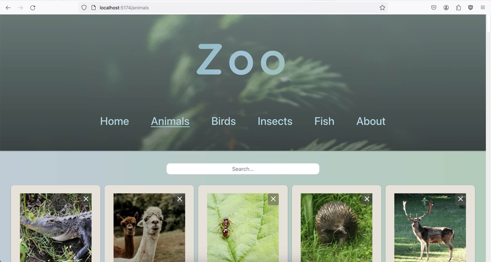

# React Zoo App

This is a simple app for displaying categories of animals and having options to like, dislike and delete them. Every animal has an additional page with a bigger image behind "See More". All the animal pictures come from https://unsplash.com/ and are randomized when the page is refreshed. The header image is using a random image with a search word "forest". The project was done as an exercise for a React course. It uses React and Vite as it's base and an Javascript object as the data. The React course and the code base was given by Margit Tennosaar at Business College Helsinki.

###Live Preview
https://zooappreact.netlify.app/
